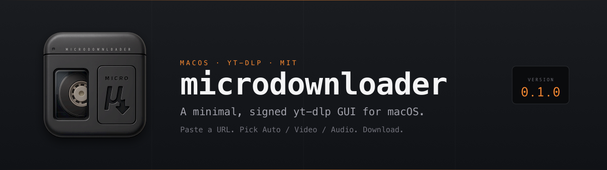
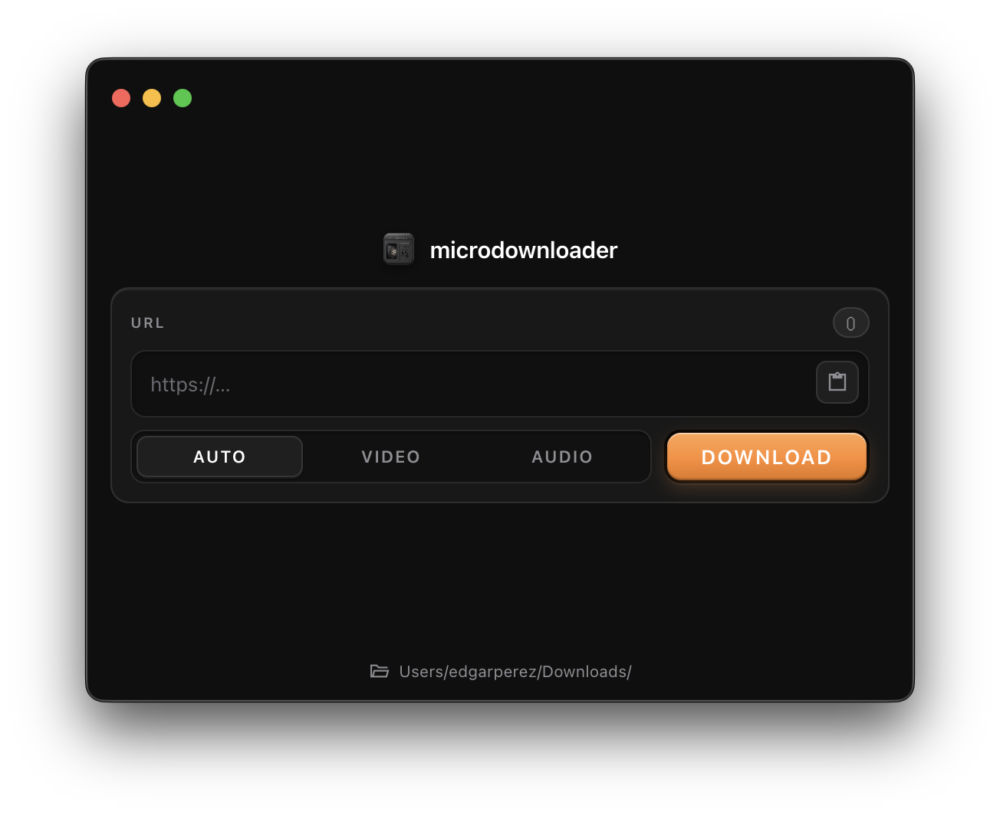

# Microdownloader: a minimal, signed yt-dlp GUI for macOS

**Status:** v0.1.0: stable, pre-1.0. Source under 1,000 lines.

A tiny, open-source desktop app for downloading video and audio from YouTube
and other sites supported by [yt-dlp](https://github.com/yt-dlp/yt-dlp).
Notarized for macOS. No Homebrew, no Terminal, no PATH wrangling.

Paste a URL. Pick **Auto / Video / Audio**. Download.



---

## Why Microdownloader

Most yt-dlp front-ends fall into one of two camps: paid closed-source apps
(Stacher, Downie, 4K Video Downloader), or open-source builds that aren't
signed for macOS, so users have to right-click → Open or run
`xattr -d com.apple.quarantine` to get past Gatekeeper.

Microdownloader fills the gap.

- **Open-source**: MIT-licensed
- **Signed and notarized**: opens like any other Mac app
- **Self-contained**: `yt-dlp` and `ffmpeg` are bundled, no install steps
- **Single screen**: one input, three format chips, one button

It shares its visual language with [Capsulo One](https://capsulo.one)
(recording and transcription), a sibling app in the same local-first style.

---

## Features

- Paste-and-go: clipboard URL detection, single-click paste button
- Three format presets: **Auto**, **Video** (mp4), **Audio** (mp3)
- Real-time progress: percentage, file size, speed, ETA
- "Show in Finder" reveal after download
- Configurable save folder, remembered between launches
- Cancellable downloads
- Native macOS vibrancy and dark UI

The single-screen UI:



---

## Requirements

- **macOS 11 (Big Sur) or later**
- **Apple Silicon or Intel**: universal `.dmg` covers both
- **~120 MB free space** for the app and bundled binaries

No local-network prompts. No accounts. No telemetry.

---

## Install

Download the latest `.dmg` from the
[Releases page](https://github.com/codedgar/microdownloader/releases),
drag the app into `Applications`, open it. Done.

The build is signed with an Apple Developer ID and notarized, so Gatekeeper
will not block it.

---

## Usage

1. Paste a video URL into the input field.
2. Pick a format:
   - **Auto**: best available video + audio, container chosen by yt-dlp
   - **Video**: best mp4 video + m4a audio, merged to mp4
   - **Audio**: best audio extracted as mp3 at highest available quality
3. Click **Download**.
4. Click **Show** to reveal the file in Finder, or **New** to queue another.

The save folder is set via the footer button and persists between launches.

### Supported sites

Anything yt-dlp supports: YouTube, Vimeo, Twitch VODs, Twitter/X, TikTok,
SoundCloud, Bandcamp, and 1,800+ others. See the
[yt-dlp supported-sites list](https://github.com/yt-dlp/yt-dlp/blob/master/supportedsites.md)
for the full set.

---

## Build from source

Requires **Node.js 18+** and macOS.

```bash
git clone git@github.com:codedgar/microdownloader.git
cd microdownloader
npm install
npm start
```

`npm install` runs `scripts/fetch-binaries.sh`, which downloads
architecture-appropriate `yt-dlp` and `ffmpeg` binaries into `resources/bin/`
(gitignored). To re-fetch later:

```bash
npm run fetch-binaries
```

### Producing a `.dmg`

For a build matching your current architecture:

```bash
npm run build:arm64   # Apple Silicon
npm run build:x64     # Intel
```

> **Note:** `npm run build` produces a *universal* DMG and expects
> `resources/bin/` to contain a universal `ffmpeg`. `fetch-binaries.sh`
> only grabs a binary for the current architecture, so a fresh clone
> will not build universal out of the box. To build universal, fetch
> both arm64 and x86_64 ffmpeg binaries and combine with `lipo`:
>
> ```bash
> lipo -create ffmpeg-arm64 ffmpeg-x86_64 -output resources/bin/ffmpeg
> ```
>
> yt-dlp's macOS release is already universal, so no extra step is needed.

---

## Project layout

```
main.js          Electron main process, spawns yt-dlp
preload.js       IPC bridge
renderer.js      UI logic
index.html       UI markup
style.css        UI styles (native vibrancy, dark surface)
resources/bin/   bundled yt-dlp and ffmpeg (gitignored)
scripts/         build and binary-fetch scripts
assets/          app icon, noise overlay, screenshots, banner
```

---

## FAQ

**Is this a fork of yt-dlp?**
No. Microdownloader is a thin Electron front-end that spawns the official
`yt-dlp` binary. yt-dlp does the actual downloading.

**Why a GUI when `yt-dlp` already exists?**
For people who don't live in a terminal. Pasting a URL into a window is
faster than remembering flags.

**Does it work on Windows or Linux?**
Not yet. The app itself is Electron and portable, but bundling, signing, and
the binary-fetch script are macOS-specific. Cross-platform builds are on the
roadmap.

**Is anything sent to a server?**
Only the request `yt-dlp` makes to the site you're downloading from. The app
has no analytics, no auto-update calls home, no accounts.

**Why does the first download take a moment to start?**
`yt-dlp` resolves formats and contacts the source site before the bytes flow.
The progress bar appears once the actual download begins.

**Can I update yt-dlp without rebuilding?**
Run `npm run fetch-binaries` against a source checkout to pull the latest.
Packaged builds use whatever binary was bundled at release time. To update,
install a newer `.dmg`.

---

## Disclaimer

This tool is for personal use with content you have the right to download.
Respect the terms of service of the sites you use it with, and respect
copyright. Don't redistribute work that isn't yours.

---

## License

[MIT](./LICENSE) for the Microdownloader source code.

The packaged `.dmg` bundles third-party software (yt-dlp, ffmpeg, Electron).
See [THIRD_PARTY_LICENSES.md](./THIRD_PARTY_LICENSES.md).

---

## Credits

- [yt-dlp](https://github.com/yt-dlp/yt-dlp): the engine
- [FFmpeg](https://ffmpeg.org/): muxing, audio extraction
- [Electron](https://www.electronjs.org/): desktop runtime

Built by [Edgar Perez](https://github.com/codedgar).
